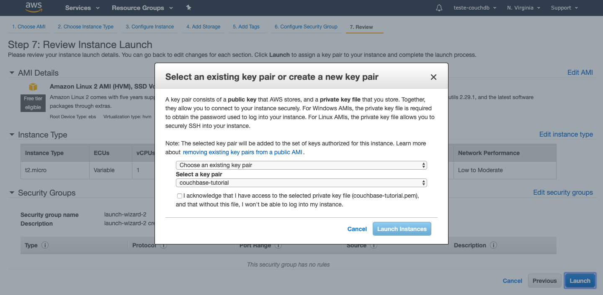
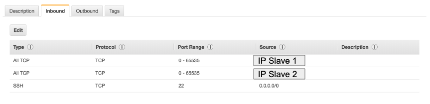
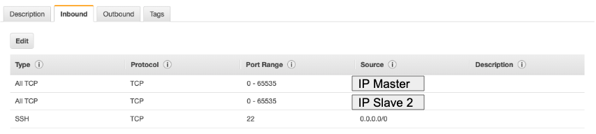
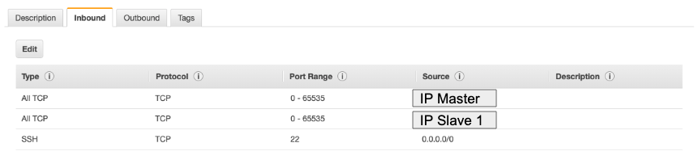
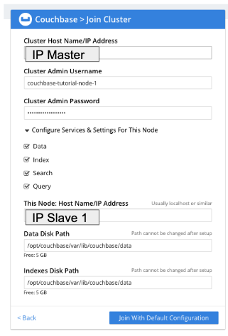
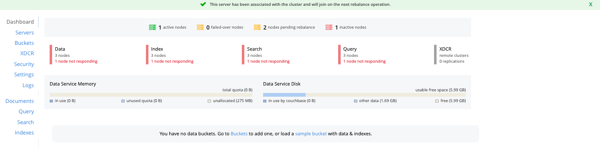
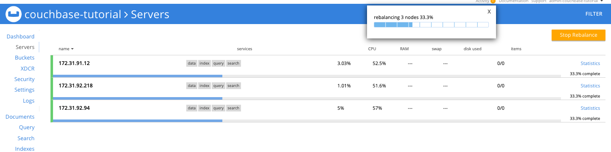
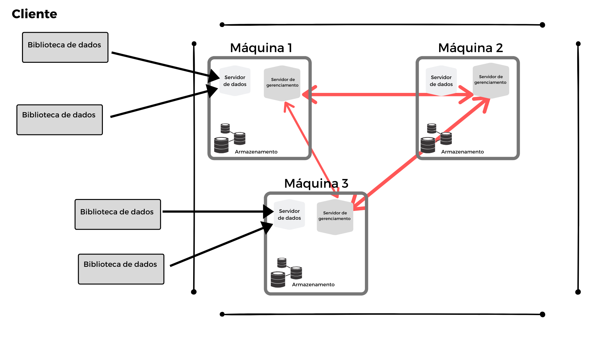

# Tutorial - Couchbase

Maria Inês Corrêa de Paula Santos

Priscila Portela Costa

Versão utilizada: Couchbase Server 6.0.0 Community

# Instalação e configuração do cluster

## Configuração local

Neste tutorial, vamos criar um servidor com 3 nós utilizando contêineres. É necessário ter o *docker* instalado em sua máquina.

Inicie as instâncias do Couchbase (db1, db2, db3) com os seguintes comandos no terminal:

    docker run -d --name db1 couchbase
    docker run -d --name db2 couchbase
    docker run -d --name db3 -p 8091-8094:8091-8094 -p 11210:11210 couchbase

Os comandos vão instalar e rodar 3 instâncias do Couchbase, todos apontados como a versão mais estável no docker (6.0.0 Community).

Para verificar que as instâncias foram iniciadas, utilize os seguintes comandos:

    docker logs db1
    docker logs db2
    docker logs db3

Se as instâncias foram iniciadas, os comandos vão retornar o *output* abaixo:

    Starting Couchbase Server -- Web UI available at http://<ip>:8091

Utilize os comandos abaixo para descobrir o endereço de IP local de cada instância. Será necessário saber os endereços de IP do db1 e db2 para configurar o terceiro nó. As configurações iniciais detectarão automaticamente o endereço de IP para o db3.

    docker inspect --format '{{ .NetworkSettings.IPAddress }}' db1
    docker inspect --format '{{ .NetworkSettings.IPAddress }}' db2

Pelo navegador, acesse [http://localhost:8091](http://localhost:8091/) para se conectar ao db3. Se a instância estiver ativa, aparecerá a tela inicial do Couchbase Server. Aceite os termos de uso e utilize as configurações padrão.

Vamos carregar os dados do *bucket travel-sample.* Clique em *Buckets* e, em seguida, em *sample-bucket* para selecionar os dados desejados.

Para adicionar db1 e db2 ao cluster, clique na aba *Server Nodes* e clique em *Add Server*. Utilize o endereço de IP utilizado para db1, encontrado nos passos anteriores. Clique em *Add Server* novamente e faça os mesmos passos para adicionar db2.

Com isso, temos um cluster de 3 nós!

## Instalação na nuvem - Amazon Web Service (AWS)

Para obtermos um cluster de 3 nós na nuvem, utilizaremos 3 instâncias [EC2](https://aws.amazon.com/pt/ec2/getting-started/), que serão criadas com as configurações padrão da Amazon. Neste tutorial, utilizaremos instâncias *Ubuntu Server 18.04 LTS (HVM), SSD Volume Type*. Você gerará automaticamente uma chave de segurança que será utilizada para acessar as instâncias. Salve-a em um local adequado com as permissões devidas (`chmod 400 minhachave.pem`). A figura abaixo mostra a tela onde se cria, renomeia e disponibiliza-se a chave para download:

A figura abaixo mostra o painel de controle da Amazon com as 3 instâncias criadas:

Verifique o IP de cada máquina e acesse cada uma delas utilizando SSH:

    ssh  -i ~/<diretorio>/couchbase-tutorial.pem ubuntu@<ip-da-maquina>

Ao acessar uma instância EC2, execute os comandos a seguir:

    wget https://packages.couchbase.com/releases/6.0.0/couchbase-server-community_6.0.0-ubuntu16.04_amd64.deb
    sudo apt-get update
    sudo dpkg -i ./couchbase-server-community_6.0.0-ubuntu16.04_amd64.deb
    sudo apt-get -f install

Com isso, todas as instâncias EC2 possuirão o Couchbase instalado.

Uma vez que as instâncias foram criadas com as configurações padrão, será necessário alterar os [grupos de segurança](https://docs.aws.amazon.com/pt_br/AWSEC2/latest/UserGuide/using-network-security.html) de cada instância para que elas possam trocar informações entre si.

A configuração do grupo de segurança da instância escolhida como *master* é ilustrada abaixo:

A configuração do grupo de segurança da instância escolhida como *slave1* é ilustrada abaixo:

A configuração do grupo de segurança da instância escolhida como *slave2* é ilustrada abaixo:

Com os grupos de segurança definidos, utilize o seguinte comando para acessar a instância master:

    ssh -i ~/<diretorio>/couchbase-tutorial.pem ubuntu@<ip-master> -L 8091:localhost:8091

Acessando o [http://localhost:8091](http://localhost:8091/), será vista a tela inicial da interface do Couchbase. Ao clicar em *New Cluster*, será aberta a tela a seguir. Escolha nomes adequados para seu uso e salve a senha escolhida.

Com isso, temos um servidor Couchbase de um nó!

## Adicionando um nó

Acesse a instância utilizada como slave-1 e inicie a interface com o seguinte comando:

    ssh -i ~/<diretorio>/couchbase-tutorial.pem ubuntu@<ip> -L 8091:localhost:8091

A tela inicial do Couchbase abrirá novamente. Ao clicar em *Join Cluster*, temos a imagem a seguir. Insira as informações corretas e clique em *Join with default configurations.*

Repita o mesmo processo para inserir a outra instância no cluster. Com isso, temos um cluster de 3 nós!

A figura abaixo mostra a tela inicial do painel de controle do Couchbase, com o número de nós ativos, nós inativos e se há necessidade de rebalanceamento.

## Inserindo dados

Para inserir informações no banco de dados e posteriormente balancear, clique em *Buckets* e carregue um *sample bucket*. Neste tutorial, utilizaremos os documentos do `beer-sample`.

## Rebalanceamento

Após inserir as informações do banco de dados, devemos rebalancear a carga de informações entre as instâncias. Clique em *Servers* e inicie o rebalanceamento utilizando o botão *Rebalance*. A figura abaixo mostra o processo de rebalancemento.

# Visão Geral

O *Couchbase* é a fusão de duas tecnologias NoSQL: o **Membase**, que fornece persistência, replicação e *sharding* para a tecnologia *memcached* de alto desempenho e o **[CouchDB](https://couchdb.apache.org/)**, pioneiro no modelo orientado a documentos baseado em JSON.

Os dados armazenados no Couchbase possuem a forma de documentos JSON de formato livre, sendo suas coleções chamadas de *keyspaces*. 

No Couchbase, um documento geralmente representa uma única instância na aplicação. É possível traçar paralelos com banco de dados relacionais, no qual uma linha seria semelhante a um documento e os atributos são semelhantes às colunas.

Entretanto, por não se tratar de um banco de dados relacional, é possível guardar documentos de diversas formas (*schemas)* no Couchbase*.* Dessa forma, a uniformidade entre documentos não é garantida e não há proximidade lógica entre os objetos em um *keyspace*.

É possível interagir com o Couchbase pelo CLI, pela interface e por uma API.

A linguagem utilizada pelo Couchbase se chama N1QL, e as maiores diferenças entre o N1QL e o SQL são relativas a modelagem dos dados (já mencionada anteriormente), a seleção, filtragem e projeção dos dados. Os comandos serão detalhados na etapa de Exercícios, onde utilizaremos os dados do `beer-sample`, com uma série de documentos pré-carregados pelo Couchbase para uso didático. 

# Arquiteturas de distribuição de dados e replicação

Semelhante a outras tecnologias NoSQL, o Couchbase é construído com base em uma arquitetura distribuída funcionando desde o início com dados agrupados em *cluster*, com escalonamento horizontal. Dessa forma, o banco de dados reside em um *cluster* de servidor que envolve várias máquinas e a biblioteca do cliente que irá se conectar aos servidores apropriados para poder acessar os dados.

Para facilitar esse dimensionamento horizontal, o Couchbase usa *shard sharding*, o que garante que os dados sejam distribuídos uniformemente por todos os nós. O sistema define 1024 partições - 1024 *vBuckets* (um número fixo) e, depois que a chave de um documento é dividida em uma partição específica, é onde o documento fica.

Fonte: OBJELEAN, A. 2019 (adaptado).

Todos os servidores de partição em um *cluster* do Couchbase são iguais, sendo cada um responsável apenas pela parte dos dados que foi atribuída a ele. Cada servidor em um cluster executa dois processos principais: um gerenciador de dados e um gerenciador de *cluster.* O gerenciador de dados lida com os dados reais na partição, enquanto o gerenciador de *cluster* lida principalmente com operações entre modos.

 A replicação dos documentos é a resiliência do sistema, o processo do gerenciador de *cluster* coordena a comunicação dos dados de replicação com os nós remotos, e o processo do gerenciador de dados supervisiona os dados da réplica que estão sendo designados pelo cluster ao nó local. Naturalmente, as partições de réplica são distribuídas por todo o cluster, para que a cópia da réplica de uma partição nunca esteja no mesmo servidor físico que a partição ativa.

Os documentos são colocados em *buckets* e os documentos em um *bucket* são isolados dos documentos em outros *buckets* da perspectiva das operações de indexação e consulta. Quando um novo dado é criado, é possível configurar o número de réplicas (até três) para esse depósito. Se um servidor travar, o sistema detectará a falha, localizará as réplicas dos documentos que residiam no sistema travado e as promoverá para o status ativo. O sistema mantém um mapa de *cluster*, que define a topologia do cluster, e isso é atualizado em resposta à falha.

# Couchbase + ACID

## A - Atomicity

O Couchbase fornece atomicidade para documentos isolados, ou seja, uma operação para obter ou criar um documento pode ser concluída com sucesso ou falha.

## C - Consistency

O Couchbase requer que a aplicação cuide da consistência de entradas, uma vez que os dois documentos abaixo são duas entradas válidas:

    key user::001
    {
        "user_name": "Priscila Portela",
        "date_created": "2019-10-25T10:10:10.0000000-03:00"
    }
    
    key user::002
    {
        "username": "Priscila Portela",
        "created_date": "2019-10-25T10:10:10.0000000-03:00"
    }

Entretanto, o Couchbase necessita que cada documento deve ter uma chave (*key*) única, ocorrendo um erro ao inserir um dado novo com uma chave já utilizada.

## I - Isolation

Na configuração padrão, o Couchbase fornece somente isolamento de leitura para um documento único.

## D - Durability

O Couchbase foi construído de forma que os resultados das operações de escrita são detectados quando recebidos pela memória, que coloca a operação em um fila para ser executada de forma assíncrona e, dessa forma, replicada para dos demais nós.

Se uma operação escreve em memória e o sistema é desativado por algum motivo, a operação não pode ser descrita como durável. Com isso, o padrão do Couchbase é privilegiar a rapidez da operações em vez de sua durabilidade.

O Couchbase permite que você altere a configuração padrão para definir um maior nível de durabilidade definindo requisitos de durabilidade, o que vai fazer com que o sistema possua maior durabilidade, mas uma menor performance. A configuração padrão é que a operação seja considerada como efetiva quando o dado é salvo em memória, mas é possível especificar o número de nós necessários para que a operação seja considerada como efetiva.

# Consistência entre nós

O Couchbase garante a consistência fazendo com que todos os processos de leitura e escrita em um documento específico passem por um mesmo nó no cluster. Views e índices possuem consistência eventual em relação aos documentos.

Todas as mudanças em uma chave são realizadas utilizando um mesmo *vBucket* no nó e estão disponíveis para todos que estão lendo o valor mais recente relacionado com aquela chave.

Ao se realizar uma consulta N1QL, é possível especificar uma das *flags* de consistência abaixo, sendo o valor padrão como `not_bounded`:

- `not_bounded`: a consulta é executada sem nenhuma verificação de consistência, e é possível que o resultado obtido pela consulta esteja desatualizado;
- `at_plus`:  a consulta é feita garantindo que os índices estejam atualizados em relação à última atualização realizada pela aplicação.
- `request_plus`: a consulta é feita garantindo que os índices estejam atualizados em relação ao *timestamp* relativo à consulta N1QL. É possível que haja um *delay* maior para uma consulta com essa flag.

# Disponibilidade

Os dados são distribuídos automaticamente pelo cluster no Couchbase Server, e as aplicações não são envolvidas nesse processo. Cada bucket é armazenado pelo serviço como 1024 vBuckets, que estão distribuídos por todos os nós disponíveis. Os documentos são armazenados dentro desses vBuckets. 

O Couchbase Server trata a adição, remoção e falha de nós de forma automática, fazendo com que não haja perda de dados. Os vBuckets e suas réplicas são redistribuídos pelos nós disponíveis assim que é detectada uma mudança na configuração do servidor.

É possível obter uma disponibilidade alta utilizando o Cross Datacenter Replication (XDCR), fazendo com que o conteúdo de um bucket seja replicado para um cluster remoto. Além disso, é possível configurar uma Server Group Awareness (SGA), definindo grupos de nós dentro do cluster a fim de proteger o cluster contra falhas de infraestrutura.

No SGA, cada grupo é criado pelo administrador. Em relação a definição de grupos e rebalanceamento, os vBuckets ativos para cada bucket estão localizados em um determinado grupo, enquanto as réplicas estão localizadas em outro grupo. Com isso, é possível definir *failovers* para cada grupo, ou seja, em caso de indisponibilidade em um grupo, os vBuckets replicados disponíveis em outro grupo são promovidos para o status de ativo.

Para se obter uma melhor proteção dos dados, é recomendada a distribuição por igual de nós entre os grupos, fazendo com que o vBuckets sejam distribuídos de forma que nenhum deles ocupe o mesmo grupo que sua réplica. Quando há um número maior de nós em um determinado grupos, o rebalanceamento não garante uma solução ótima: é possível que os vBuckets replicados ocupem o mesmo grupo que o vBucket ativo, fazendo com que haja perda de dados caso o grupo mencionado se torne indisponível.

# Escalabilidade

O Couchbase Server foi idealizado com o objetivo de tornar a escalabilidade um processo simples. Os *clusters* podem ser aumentados ou diminuídos de acordo com a demanda diretamente na interface, por APIs ou pelo CLI.

## Adicionando um nó

Para se escalar o servidor na arquitetura proposta, será necessário executar os seguintes passos:

1. Carregar uma nova instância EC2;
2. Instalar o Couchbase na instância;
3. Alterar os grupos de segurança de todos os nós do cluster;
4. Adicionar o novo nó no cluster 
    1. Pela interface: ver seção Adicionando um nó
    2. Pelo CLI: 

        couchbase-cli server-add -c <ip-master>:8091 --username <user-master> \
         --password <senha> --server-add <ip-novo-nó>:8091 \
         --server-add-username <user-master> --server-add-password <senha>
         --services data,index,query

5. Realizar o rebalanceamento
    1. Pela interface: ver seção Rebalanceamento
    2. Pelo CLI:

        couchbase-cli rebalance -c <ip-master>:8091 --username <user-master> \
         --password <senha>

## Removendo um nó

Para remover um nó na arquitetura proposta, será necessário executar os seguintes passos:

Pela interface:

1. Clique em *Servers*
2. Clique no nó desejado
3. Clique em *Remove*
4. Realize o rebalanceamento: ver seção Rebalanceamento

Pelo CLI:

    couchbase-cli rebalance -c <ip-master>:8091 --username <user-master> \
     --password <senha> --server-remove <ip-nó-removido>:8091

# Exemplos de empresa que utilizam o Couchbase

## Aol

O [Advertising.com](http://advertising.com/), de propriedade da AOL, é uma das maiores redes de anúncios do mundo, com bilhões de impressões por mês e centenas de milhões de visitantes. Ela utiliza o Couchbase Server para armazenar e acessar em tempo real os seus perfis de visitantes,também utilza o plug-in do Couchbase Server para  para importar e exportar dados para o *Hadoop*. Além disso, após a exibição dos anúncios, os perfis dos visitantes são atualizados para melhorar a segmentação e o posicionamento dos anúncios. O cache integrado no Couchbase Server permite que os perfis de visitantes das campanhas ativas residam na memória para fornecer tempos de resposta abaixo de milissegundos, enquanto o modelo de dados flexível permite que o [Advertising.com](http://advertising.com/) refine continuamente os algoritmos de segmentação, enriquecendo os dados.

## Paypal

O [PayPal](https://www.paypal.com/br/home) integrou o *Couchbase Server, Storm e Hadoop* para criar a base de sua plataforma de análise em tempo real. Os dados de fluxo de cliques e de interação de todos os canais são enviados para a plataforma para análise em tempo real. Os dados são extraídos em um processador de fluxo, *Storm*, para filtragem, enriquecimento e agregação. Depois que os dados são processados, eles são gravados no Couchbase Server, onde são acessados ​​por ferramentas avançadas de visualização. Com essas ferramentas, o *PayPal* pode monitorar todo o tráfego em tempo real. Além disso, o PayPal aproveita as visualizações no Couchbase Server para executar agregação e filtragem adicionais. Por fim, os dados são exportados do Couchbase Server para o Hadoop para análise offline.

## Tesco

A [Tesco](https://www.tesco.com/), maior varejista da Europa, está adotando o Couchbase Server para vários casos de uso, incluindo um serviço centralizado para armazenar e gerenciar dados de milhões de produtos, que podem ser aproveitados em toda a empresa.  A Tesco está migrando para a plataforma NoSQL distribuída da Couchbase, a fim de fornecer a flexibilidade para acomodar uma gama diversificada de dados que mudam rapidamente, além de desempenho, disponibilidade e escalabilidade para suportar um grande número de usuários, grandes quantidades de dados e muito alto requisitos de taxa de transferência. À medida que os requisitos da Tesco crescem, o Couchbase Server fornece escalabilidade fácil e com botões de pressão, permitindo que o varejista simplesmente adicione nós sob demanda à medida que as necessidades de capacidade e taxa de transferência do sistema aumentam.

## Ryanair

A [Ryanair](https://www.ryanair.com/pt/pt/), uma das maiores e mais bem-sucedidas companhias aéreas da Europa, está reformulando seu aplicativo móvel para suportar mais de 1 milhão de viajantes, passando de um banco de dados relacional para o NoSQL usando o Couchbase Mobile. A empresa queria superar as limitações da tecnologia relacional para melhorar significativamente a qualidade, disponibilidade e funcionalidade de seu aplicativo móvel e fornecer uma ótima experiência para os usuários móveis. 

## **Plataformas de Antifraude**

Uma plataforma líder de detecção de fraudes, que processa mais de 50% das transações com cartões de crédito e débito no mundo, é operada pelo Couchbase Server. A empresa selecionou o Couchbase Server como um banco de dados distribuído para a plataforma de detecção de fraude, porque seu cache integrado na memória permite acesso de menos de milissegundos aos dados do cliente e regras de detecção de fraude, e porque pode ser escalado com um número crescente de portadores de cartão e transações. de uma maneira econômica. clientes que realizam bilhões de transações por ano, em tempo real. 

# Quando utilizar o Couchbase? ✅

- Necessidade de escalabilidade dinâmica e *load balancing*;
- Aplicações de Data Lake;
- Número de campos dinâmico;
- Necessidade de operações realizadas de forma rápida;
- Atividades de usuário em tempo real;
- IOT ( "Internet das coisas");
- Detecção de fraudes.

# Quando não utilizar o Couchbase? ❌

- São necessárias atualizações constantes na base de dados;
- O modelo de negócio necessita de busca por texto;
- *Views* se tornam lentas de acordo com o aumento da base de dados;
- Necessidade de *transactions;*
- Contato frequente com usuário final: chaves com nomes descritivos ocupam espaço e aumentam o tempo de processamento;
- A aplicação não trata inconsistências.

# Exercícios

Os exercícios a seguir utilizarão os documentos obtidos do `beer-sample:`

1. Quais as cervejas feitas pela cervejaria de id "mishawaka_brewing"?

    SELECT name 
    FROM `beer-sample` 
    WHERE brewery_id ='mishawaka_brewing';

2. Selecione o endereço, a cidade e o país da cervejaria Aass Brewery

    SELECT address, city, country 
    FROM `beer-sample` 
    WHERE type='brewery' and name = 'Aass Brewery';

3. Crie um índice na característica abv

    CREATE INDEX abv_idx ON `beer-sample`(abv);

4.  Encontre todas as cervejarias a partir de uma determinada latitude cujo nome possui a palavra *Brew*

    SELECT name, address, city, country 
    FROM `beer-sample` 
    WHERE type='brewery' AND geo.lat > 43.0 AND name LIKE '%Brew%'
    ORDER BY name;

5. Delete todos os registros da Espanha

    DELETE
    FROM `beer-sample`
    WHERE country='Spain';

6. Faça uma consulta acessando subitens de um documento

    SELECT bw.name AS brewer, br.name AS beer
    FROM `beer-sample` br join `beer-sample` bw
     on keys br.brewery_id
    ORDER BY bw.name, br.name
    LIMIT 10;

# Glossário

1. *Docker:* plataforma open source de contêineres.
2. *Bucket:* são contêineres virtuais isolados que agrupam logicamente registros em um cluster.
3. S*ample-bucket :* onde se encontram os dados prontos para serem experimentados.
4. *Cluster:* A arquitetura de cluster de banco de dados é formada pela redundância do seu banco de dados em 2 instâncias ou mais instâncias. Estas instâncias, então, são balanceadas de forma a dividir com eficiência a quantidade de requisições ao banco.
5. S*harding:* é uma forma de particionamento para distribuir a carga de trabalho computacional e de armazenamento em uma rede ponto a ponto (point- to point) para que cada nó não seja responsável pelo processamento da carga transacional de toda a rede*.*
6. *JSON ou JavaScript Object Notation*: é um modelo para armazenamento e transmissão de informações no formato texto. É simples e estrutura as informações de uma forma bem mais compacta do que a conseguida pelo modelo XML, tornando mais rápida a análise dessas informações.
7. *Shard sharding*: é a junção de *shard*, uma partição horizontal de dados em um banco de dados, juntamente com o *sharding* já explicado no item 5.
8. *Memcached:* Armazenamento em memória de conjuntos chave-valor para pequenos conjuntos de dados resultantes de requisições de API ou de consultas de banco de dados.
9. *vBucket:* é definido como o proprietário de um subconjunto do espaço da chave de um cluster do Couchbase. O sistema vBucket é usado para distribuir dados pelo cluster e para oferecer suporte a réplicas em mais de um nó. As vezes podem ser chamados de às vezes de shards e são criados 1024 para cada bucket, esses 1024 implementam um intervalo definido e são referidos como vBuckets ativos . Se um bucket for replicado, cada réplica será implementada como mais 1024 (ou 64) vBuckets, denominados vBuckets de réplica.

    

    Fonte: couchbase (adaptado).

# Referências

COUCHBASE. Documentação oficial. Disponível em : [link](https://docs.couchbase.com/server/6.0/getting-started/start-here.html). Acessado em : outubro de 2019.

COUCHBASE. The TOP 10 Enterprise NoSQL uses cases. Diponível em: [link](https://resources.couchbase.com/c/top-10-nosql-usecases?x=SxFI6d). Acessado em outubro de 2019.

OBJELEAN, A. Introduction to Couchbase - NoSQL Document Database. Disponível em: [link](https://www.todaysoftmag.com/article/1506/introduction-to-couchbase-nosql-document-database). Acessado em: outubro de 2019.